# From HMM to HSMM: Human Activity Recognition with Stochastic Models

This project recognises six human activities from smartphone sensor data using interpretable stochastic models. It starts from a standard Gaussian hidden Markov model and refines it twice. Each refinement is driven by a statistical test of the previous model's assumptions:

**Gaussian HMM → GMM-HMM → Hidden semi-Markov model (HSMM)**

The final HSMM, which models how long each activity lasts, reaches **94.1%** window-level accuracy on held-out subjects. That compares with 87.6% for a Random Forest and 84.9% for the same emission model classifying each window independently.

This work was carried out by Pratham Arora and Vaisakh Menon as the course project for *Stochastic Process for Data Science and Engineering*.

## The problem

Activity recognition supports healthcare monitoring, fitness tracking, elderly-care assistance and smart-home applications. Deep learning models perform well on this task but are hard to interpret. This project instead treats activity recognition as a hidden-state problem. The activity (walking, sitting, standing, ...) is a discrete hidden state that cannot be read directly from the accelerometer and gyroscope. The sensor features are noisy observations emitted by that state. Recognising activities then means decoding the most likely sequence of hidden states. Every component of the model (emissions, transitions, durations) has a direct probabilistic meaning and can be tested against the data.

## Data

The project uses the [UCI Human Activity Recognition Using Smartphones](https://archive.ics.uci.edu/dataset/240/human+activity+recognition+using+smartphones) dataset (2012):

- 30 volunteers aged 19 to 48, each carrying a Samsung Galaxy S II on the waist.
- Accelerometer and gyroscope signals sampled at 50 Hz, summarised into 561 features over 2.56 s windows with 50% overlap.
- Six states: `WALKING`, `WALKING_UPSTAIRS`, `WALKING_DOWNSTAIRS`, `SITTING`, `STANDING`, `LAYING`.
- No missing values.

| Split | Windows | Subjects |
| --- | --- | --- |
| Train | 7,352 (70%) | 21 |
| Test | 2,947 (30%) | 9 |

Many of the 561 features are strongly correlated. Features are standardised and projected onto the first 65 principal components, which retain about 90% of the variance and keep the emission covariance matrices well conditioned. The scaler and the PCA are fit on the training split only.

| Class balance | PCA explained variance |
| --- | --- |
| 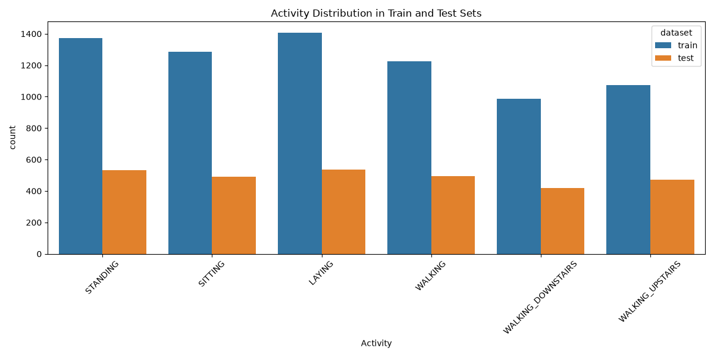 | 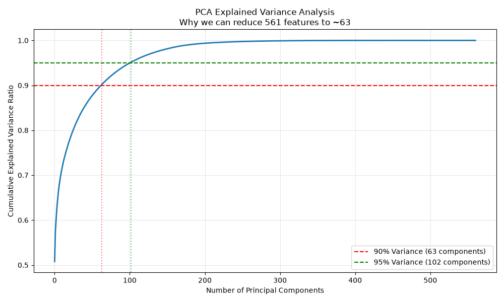 |

The data is not included in this repository. See [data/README.md](data/README.md) for download instructions.

## Approach

### Phase 1: Gaussian HMM

The initial proposal was a standard HMM:

- **Hidden states $S_t$:** the six activities.
- **Observations $\mathbf{x}_t$:** the 65 PCA features of window $t$.
- **Emission assumption:** given the activity, the features follow a single multivariate Gaussian, $P(\mathbf{x}_t \mid S_t = j) = \mathcal{N}(\mathbf{x}_t; \boldsymbol{\mu}_j, \boldsymbol{\Sigma}_j)$.

Each activity gets its own small HMM with three hidden sub-states and diagonal covariances. Every contiguous segment of the activity is a separate training sequence. Before trusting this model, its assumptions were tested on the training data.

**Gaussianity (Shapiro-Wilk).** If the emissions were Gaussian, the Q-Q points would lie on the reference line. Normality is rejected for every activity and each of the top three principal components (p < 1e-8). The tails deviate strongly, indicating heavy tails or multiple modes.

**Residual analysis.** Under a correct model, the residuals around each activity's mean should look like white noise. Instead they show clear structure and strong autocorrelation.

**Stationarity (Augmented Dickey-Fuller).** A standard HMM assumes constant emission parameters within an activity. On the longest segment of each activity, ADF rejects a unit root for sitting, standing and walking upstairs, but not for laying, walking or walking downstairs. The signal within some activities drifts over time, for example through fatigue or changes in posture, which a single fixed Gaussian ignores.

| Q-Q plots | Residuals vs fitted values |
| --- | --- |
| 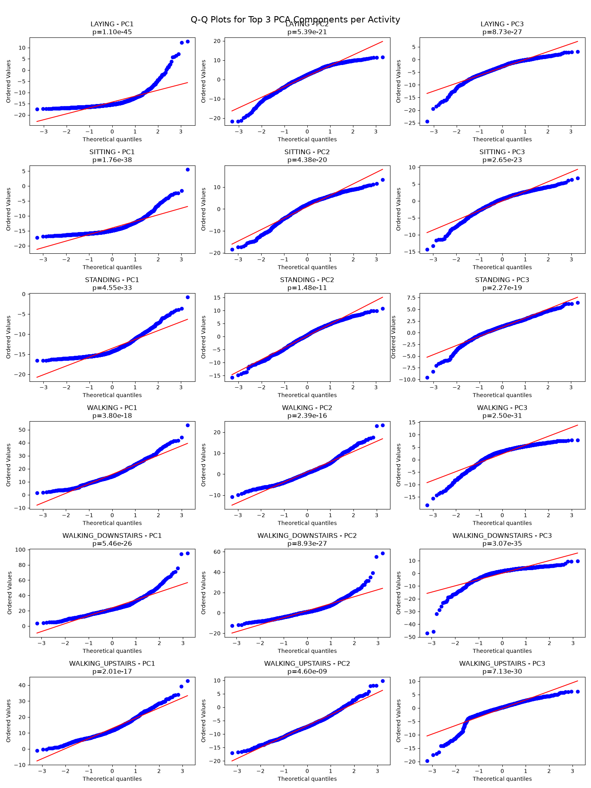 | 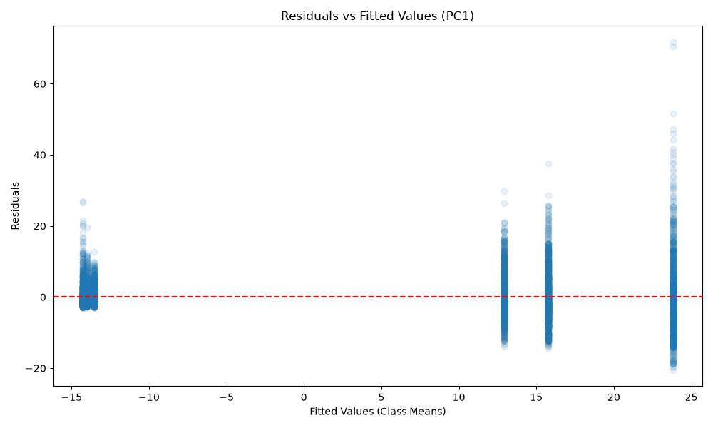 |

### Phase 2: GMM-HMM

To fix the failed Gaussian assumption, each sub-state's emission was upgraded to a Gaussian mixture with $M = 2$ components:

$$
b_j(\mathbf{x}) = \sum_{k=1}^{2} c_{jk}\, \mathcal{N}(\mathbf{x};\, \boldsymbol{\mu}_{jk}, \boldsymbol{\Sigma}_{jk})
$$

A mixture can represent sub-states within one activity, such as the heel-strike and toe-off phases of a walking stride.

**Goodness of fit (AIC).** Two components beat one for every activity. The AIC improvements range from 132 (walking) to 1340 (laying).

**Conditional independence (autocorrelation).** An HMM assumes $P(\mathbf{x}_t \mid \mathbf{x}_{t-1}, S_t) = P(\mathbf{x}_t \mid S_t)$. This fails: lag-1 autocorrelation of the residuals within segments is 0.53 to 0.91. Consecutive windows overlap by 50% and the signal is sampled at 50 Hz, so neighbouring observations are strongly correlated.

**Mitigation by downsampling.** Keeping every k-th window reduces the autocorrelation, but slowly. For walking it falls from 0.91 to 0.63 at a factor of 8, by which point seven-eighths of the data is gone. The full-rate data was kept and the independence violation accepted. HMMs are known to be fairly robust to it.

| GMM vs single Gaussian | Residual autocorrelation |
| --- | --- |
| 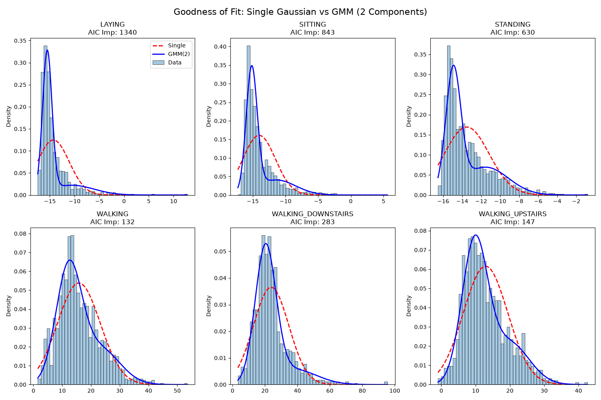 | 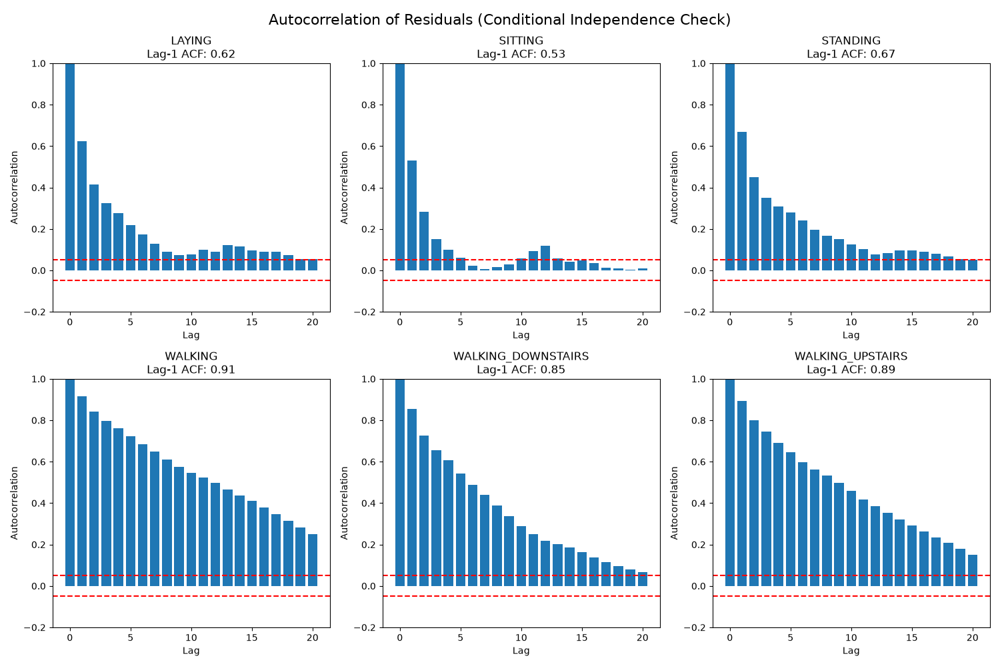 |

**The Markov property at frame level.** A likelihood-ratio test compares a first-order chain with a second-order chain, $P(S_t \mid S_{t-1}, S_{t-2})$ against $P(S_t \mid S_{t-1})$, on the window-by-window label sequence. It rejects the first-order assumption (G = 20.3, p < 1e-5): history matters at the frame level.

The frame-level transition matrix explains why. Self-transitions dominate, with probabilities of about 0.95 to 0.97. Under an HMM, the time spent in a state is therefore geometric: the probability of staying $d$ windows decays as $a_{jj}^{d}$. The most likely duration is always a single window. Real activities do not behave like that; they last a characteristic amount of time.

**Conclusion of Phase 2.** The GMM-HMM fixes the emission problem, and with Viterbi decoding reaches 92.0% accuracy. But the failed Markov test points to a structural flaw: the model's implicit treatment of duration is wrong.

### Phase 3: Hidden semi-Markov model

The HSMM makes duration explicit:

- **Duration distribution.** Each activity $j$ has a Gaussian duration $P(D_j = d) = \mathcal{N}(d; \mu_{\text{dur},j}, \sigma_{\text{dur},j}^2)$, estimated from the training segments. The probability of staying in an activity no longer decays geometrically. It peaks at the activity's typical length: about 30 windows for the static activities and 18 to 20 for the stair activities.
- **Embedded Markov chain.** Transitions are modelled only when the activity changes (for example, walking to sitting), not every window. Self-transitions are excluded by construction.
- **Emissions.** The GMM-HMM likelihoods from Phase 2.

The HSMM assumptions were tested as well.

**Duration distribution fit (Kolmogorov-Smirnov).** Normal and Log-Normal fits to the segment lengths have KS distances of 0.08 to 0.24. The geometric fit implied by a standard HMM has 0.28 to 0.55. Explicitly modelling duration is statistically justified.

**Embedded Markov property.** On the compressed sequence of distinct activities, the likelihood-ratio test does not reject a first-order chain (p = 1). This result should be read with care. The UCI recording protocol has subjects perform the activities in a nearly fixed order, so the embedded chain is close to deterministic and the test has little power.

| Duration fits | Frame-level vs embedded transitions |
| --- | --- |
| 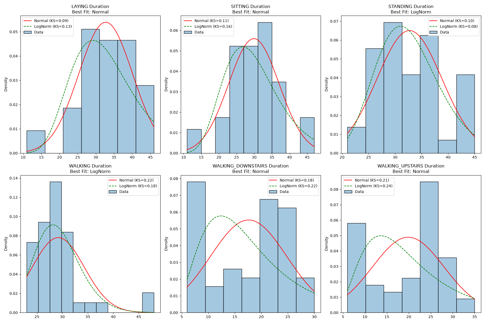 | 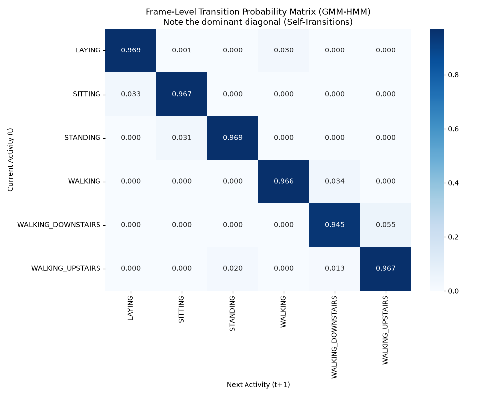 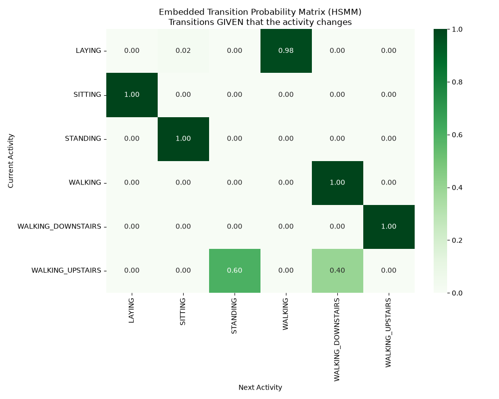 |

### Viterbi vs duration-explicit Viterbi

**Standard Viterbi** decides window by window: what is the best state at time $t$, given the best path to $t-1$? Its duration model is implicitly geometric ($0.97^d$), which penalises long stays and allows one-window "flickers" to a different activity whenever a single window looks ambiguous.

**Duration-explicit Viterbi** decides segment by segment: what is the best duration $d$ for the current segment, and the best previous activity $i$?

$$
\delta_t(j) = \max_{d,\, i \neq j} \Big[ \delta_{t-d}(i) + \log a_{ij} + \log P(D_j = d) + \sum_{\tau = t-d+1}^{t} \log b_j(\mathbf{x}_\tau) \Big]
$$

It searches over segment lengths directly, so it enforces the bell-shaped duration structure verified above. A segment far shorter than an activity's typical duration is very unlikely, so isolated flickers disappear. Segments are limited to 50 windows; the longest training segment is 48. Because a recording can start or end part-way through an activity, the first and last segments are scored with the survival function $P(D_j \ge d)$.

On subject 12, standard Viterbi briefly flips between sitting and standing twice. The HSMM decodes those segments cleanly. Both models miss the final walking-upstairs segment.

| Standard Viterbi (GMM-HMM), subject 12 | Duration Viterbi (HSMM), subject 12 |
| --- | --- |
| 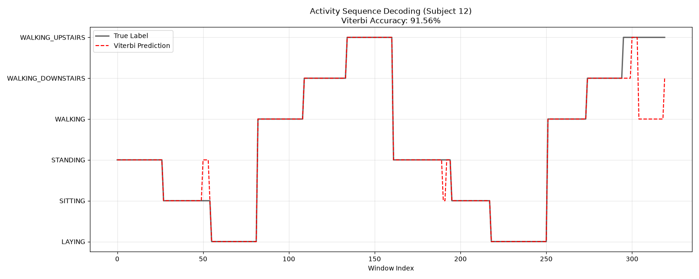 | 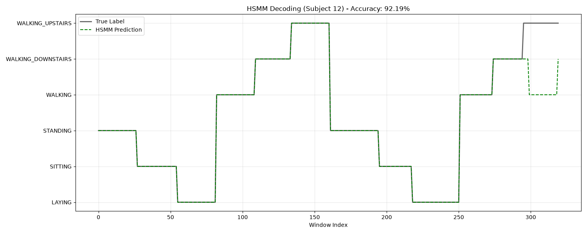 |

## Results

Accuracy is measured per window on the held-out test subjects. "Overall" covers all 9 test subjects. Subjects 2, 9 and 12 are the three used for the per-subject plots. All numbers are produced by the scripts in this repository (`outputs/tables/model_comparison.csv`).

| Model | Overall | Subject 2 | Subject 9 | Subject 12 |
| --- | --- | --- | --- | --- |
| Gaussian Naive Bayes | 80.7% | 89.4% | 77.8% | 83.8% |
| Random Forest | 87.6% | 92.4% | 85.4% | 86.6% |
| Gaussian HMM (frame-level) | 85.3% | 90.4% | 80.9% | 85.9% |
| GMM-HMM (frame-level) | 84.9% | 91.1% | 79.5% | 86.6% |
| GMM-HMM (Viterbi) | 92.0% | 95.0% | 90.6% | 91.6% |
| **HSMM (duration Viterbi)** | **94.1%** | **97.7%** | **92.0%** | **92.2%** |

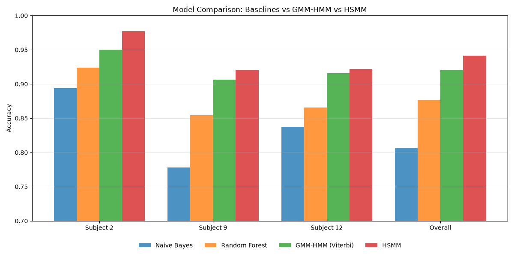

Classifiers that label each window independently, whether static or HMM-based, stay between 81% and 88%. The gain comes from decoding whole sequences: Viterbi raises the GMM-HMM from 84.9% to 92.0%. Explicit duration modelling adds another two points, to 94.1%. The HSMM is the best model on every focus subject, with 88% to 100% accuracy on each of the nine test subjects.

| GMM-HMM, frame-level | HSMM |
| --- | --- |
| 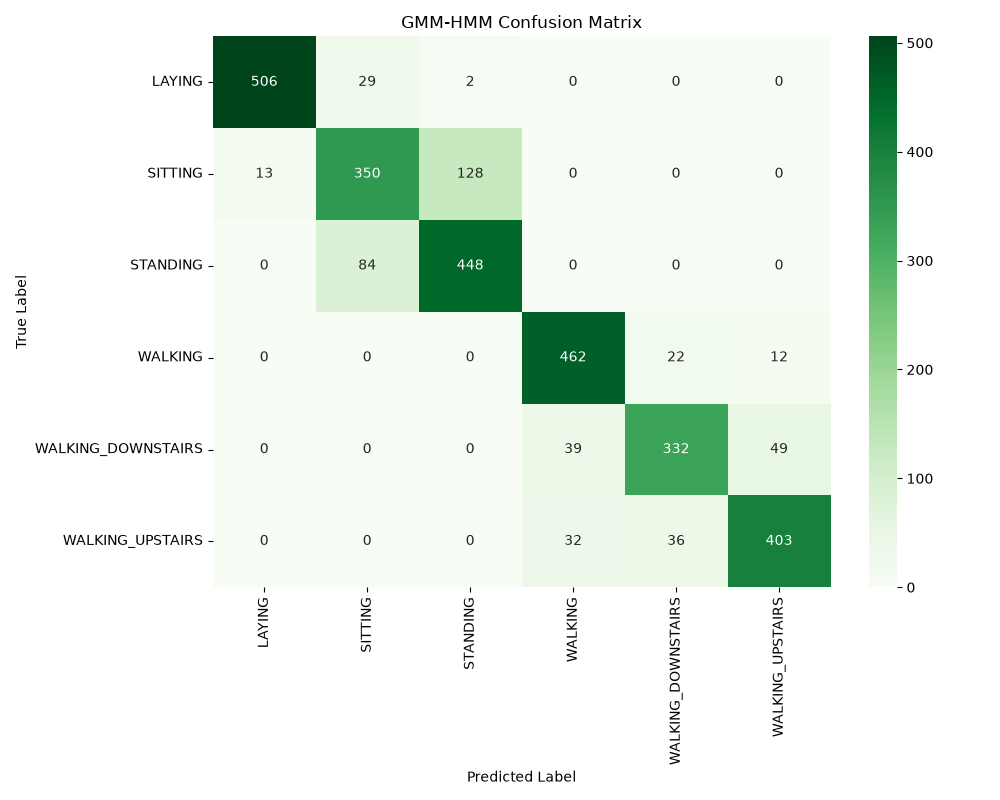 | 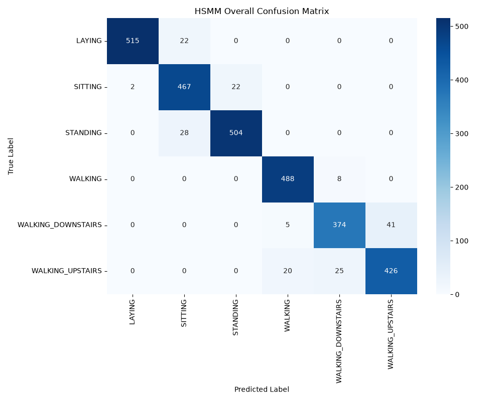 |

The confusion matrices show where the improvement comes from. The frame-level model confuses sitting and standing in both directions, because a single window of a still posture is ambiguous. The HSMM resolves most of these cases from context. Its remaining errors are split between the two stair activities and the static group (sitting with standing, and laying with sitting). Many of them sit at segment boundaries.

### Limitations

- The UCI protocol has activities performed in a nearly fixed order. The transition matrices learn that order, and it accounts for part of the gain of the sequence models. Accuracy on free-living data, where activities change unpredictably, is likely to be lower.
- The conditional-independence assumption is violated and was accepted rather than modelled. An autoregressive HMM could model it directly.
- All models share the same 65-component PCA features, and no hyperparameter search was performed.

### Future directions

- **Hierarchical HMMs**, for composite activities made of atomic actions (for example, cooking as chopping, stirring and washing).
- **Online adaptation** of the emission parameters, for example with recursive EM, to follow a user whose behaviour changes over time.
- **Hybrid DNN-HSMM models**, in which a neural network estimates the emission probabilities and the HSMM keeps the interpretable temporal structure.

## Repository structure

```
.
├── data/                       Dataset location and download instructions
├── docs/
│   ├── final_report.pdf        Final report (LaTeX source in final_report.tex)
│   └── proposal.tex            Original project proposal
├── outputs/
│   ├── figures/                Generated plots
│   └── tables/                 Generated result tables (CSV)
├── scripts/                    Numbered entry points, one per pipeline stage
├── src/har/                    Shared library code
│   ├── config.py               Paths and experiment settings
│   ├── data.py                 Loading, standardisation and PCA
│   ├── models.py               Class-conditional Gaussian HMM and GMM-HMM emission models
│   ├── decoding.py             Viterbi and duration-explicit (HSMM) Viterbi decoding
│   ├── sequences.py            Run lengths, transition matrices, Markov-order test
│   ├── evaluation.py           Accuracy tables
│   └── plotting.py             Plot helpers
├── tests/                      Unit tests for the sequence statistics and decoders
├── Makefile
└── pyproject.toml
```

## Getting started

Requires Python 3.9 or later.

```bash
git clone https://github.com/prats3992/hmm-to-hsmm-activity-recognition.git
cd hmm-to-hsmm-activity-recognition
python -m venv .venv
source .venv/bin/activate        # on Windows: .venv\Scripts\activate
pip install -e .
```

Then download the dataset into `data/` as described in [data/README.md](data/README.md).

## Running the pipeline

Run the scripts from the repository root, in order:

| Script | Purpose |
| --- | --- |
| `scripts/01_exploratory_analysis.py` | Class and subject distributions, feature correlations, PCA explained variance |
| `scripts/02_gaussian_hmm_assumptions.py` | Gaussianity, stationarity and residual tests for the Gaussian HMM |
| `scripts/03_gaussian_hmm.py` | Gaussian HMM, frame-level classification |
| `scripts/04_gmm_hmm_assumptions.py` | Mixture fit (AIC), residual autocorrelation, downsampling, frame-level Markov test |
| `scripts/05_gmm_hmm.py` | GMM-HMM, frame-level classification and Viterbi decoding |
| `scripts/06_hsmm_assumptions.py` | Embedded Markov test, duration distribution fits, transition matrices |
| `scripts/07_hsmm.py` | HSMM with duration-explicit Viterbi decoding |
| `scripts/08_baselines_and_comparison.py` | Naive Bayes and Random Forest baselines, final comparison |

Alternatively, run every stage with:

```bash
make all
```

Run the unit tests with `make test` (after `pip install -e ".[test]"`).

Each script prints its results and writes figures to `outputs/figures/` and tables to `outputs/tables/`. The full pipeline takes a few minutes on a laptop. Most of that time is spent on per-window likelihood evaluation and HSMM decoding.

Experiment settings are in [src/har/config.py](src/har/config.py): number of principal components, number of sub-states and mixtures, the maximum HSMM segment length, and the subjects used for the per-subject plots.

## Documentation

- [docs/final_report.pdf](docs/final_report.pdf): the full report, covering the model progression, assumption tests and discussion. It was written before the final revision of the code; the numbers in this README supersede it.
- [docs/proposal.tex](docs/proposal.tex): the original project proposal.

## Authors

Pratham Arora and Vaisakh Menon.

## References

1. D. Anguita, A. Ghio, L. Oneto, X. Parra and J. L. Reyes-Ortiz. A Public Domain Dataset for Human Activity Recognition Using Smartphones. *ESANN*, 2013.
2. L. R. Rabiner. A Tutorial on Hidden Markov Models and Selected Applications in Speech Recognition. *Proceedings of the IEEE*, 77(2):257-286, 1989.
3. S.-Z. Yu. Hidden Semi-Markov Models. *Artificial Intelligence*, 174(2):215-243, 2010.
4. C. M. Bishop. *Pattern Recognition and Machine Learning*. Springer, 2006.
